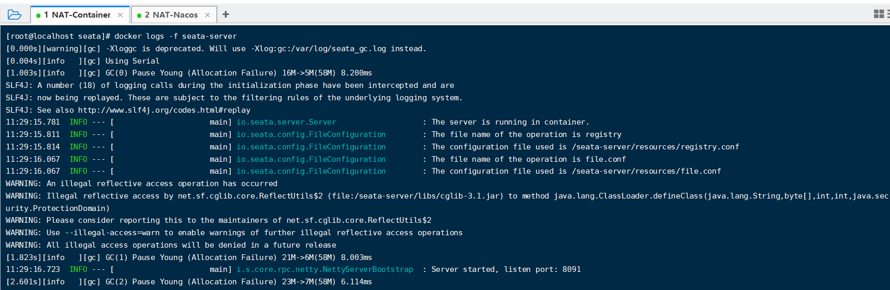
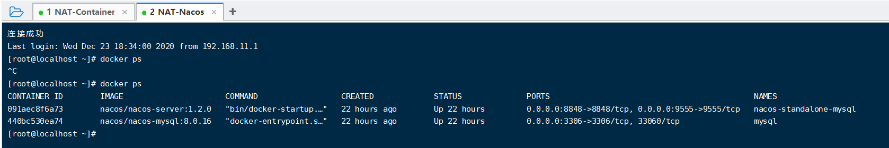

# Seata-demo案例

### 一、Seata安装

##### 1、 新建seata-server文件夹

```sh
mkdir seata-server
cd seata-server
```

##### 2、 创建配置文件文件

- 创建docker-compose.yml文件 vi docker-compose.yml

  ```yaml
  version: "3"
  services:
    seata-server:
      image: seataio/seata-server
      hostname: seata-server
      container_name: seata-server
      ports:
        - "8091:8091"
      environment:
        - SEATA_PORT=8091
      volumes:
        - ./config:/root/seata-config
  ```

- 在 Compose 同级目录下创建配置文件 `vi config/registry.conf`

  ```yaml
  registry {
    type = "file"
  
    file {
      name = "file.conf"
    }
  }
  
  config {
    type = "file"
  
    file {
      name = "file.conf"
    }
  }
  ```

- 在 Compose 同级目录下创建配置文件 `vi config/file.conf`

  ```yaml
  service {
    # 自定义事务组名称 tx_group，客户端配置需要和服务端一致
    vgroup_mapping.tx_group = "default"
    default.grouplist = "127.0.0.1:8091"
    disableGlobalTransaction = false
  }
  
  store {
    mode = "file"
  
    file {
      dir = "sessionStore"
    }
  }
  ```

##### 3、 在docker-compose.yml所在文件夹执行启动命令

```sh
docker-compose up -d
```

##### 4、 查看启动日志



### 二、Nacos安装

##### 1、 执行git命令获取nacos-docker配置

```sh
git clone https://github.com/nacos-group/nacos-docker.git
```

##### 2、 在nacos-docker文件夹执行启动命令

```sh
docker-compose -f example/standalone-mysql-5.7.yaml up -d
```

##### 3、 查看nacos启动情况

